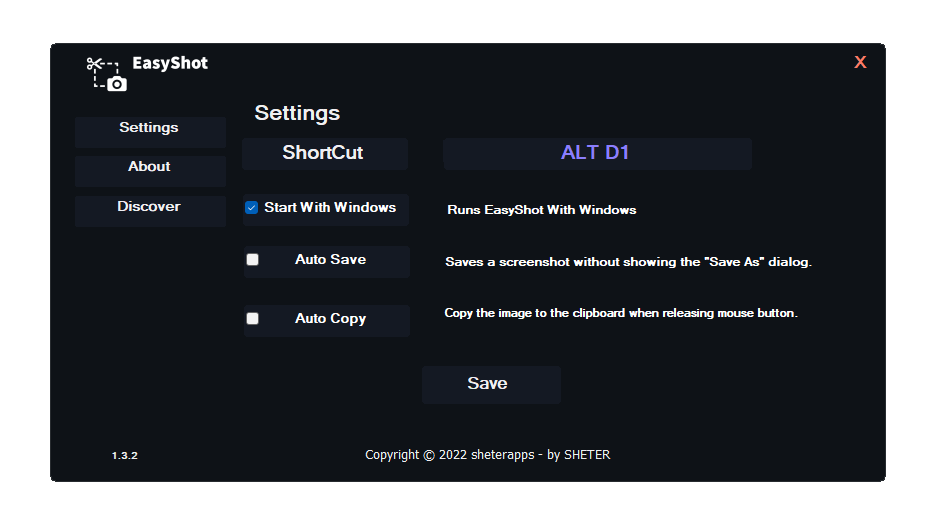
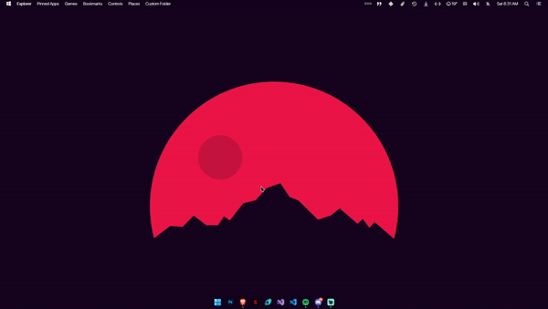

<h1 align="center">
     
    
Easyshot

    
   

</h1>

# 📚 About
An app that allow you to make a screen shot in 2 clicks. Together with Tesseract OCR, an Engine that Extract Text from images, It forms one of the strongest screen capture tools one can ever use and experience.

# Screenshot:

## 🧰 Features
A list of some of the features that are included in Easyshot
* 🔐 **Fast screenshot** - select any area on your desktop and take its screenshot with 2 button-clicks.
* 🔒 **Easy to use Application** - Simple and intuitive user interface makes your work with the app easier and faster.
* 💎 **Image To Text** - Extract text from any image with Tesseract OCR.
* 🖥️ **Powerful editors** - You can edit screenshots instantly when taking them.

## 📞 Issues
If you have any issues feel free to open an issue or contact me on Discord (SHETER#9999).

## 🧲 Extra
__Created by SHETER#9999__
* [Website](https://sheterapps.com)
* [Twitter](https://twitter.com/SHETER9)
* [Instagram](https://www.instagram.com/sheter0/)
 
